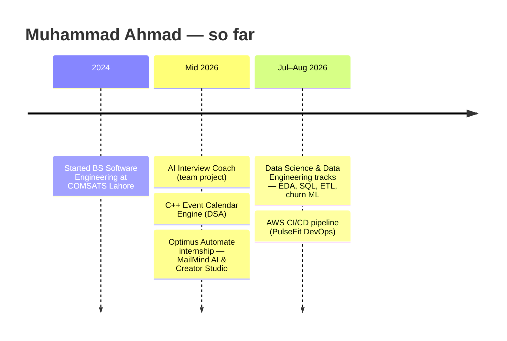

<!-- ═══════════════════════════  HEADER  ═══════════════════════════ -->
<p align="center">
  
</p>

<p align="center">
  <a href="https://github.com/ahmadmuzii">
    
  </a>
</p>

<p align="center">
  <a href="https://www.linkedin.com/in/muhammad-ahmad-muzzamil"></a>
  <a href="mailto:mahmadmuzi@gmail.com"></a>
  
</p>

---

## 👨‍💻 About Me

```python
class MuhammadAhmad:
    role       = "Software Engineering Student · Full-Stack & AI Developer"
    university = "COMSATS University Islamabad, Lahore Campus  (BS SE, 2024 – 2028)"
    based_in   = "Lahore, Pakistan 🇵🇰"
    work       = ["Freelance AI Analyst — LLM evaluation & QA",
                  "Optimus Automate — Virtual Internship (AI products)",
                  "Data Science & Data Engineering internship tracks"]
    loves      = ["shipping end-to-end products", "LLM pipelines that fail gracefully",
                  "data structures done right", "clean, documented code"]
    learning   = ["Docker", "CI/CD on AWS", "System Design", "Cloud deployment"]

    def motto(self):
        return "Build it, measure it, make it better."
```

- 🎙️ Built an **AI Interview Coach** that listens to your answer, watches your body language and coaches you with LLMs.
- 📬 Built **MailMind AI**, which reads a Gmail inbox, classifies intent & urgency and drafts replies with Groq.
- 📅 Wrote a **C++ calendar engine** on an AVL tree, hash table and min-heap — exposed as a REST API to a React UI.
- 🧪 As a freelance **AI Analyst**, I design multi-turn prompts and grade agent responses against rubrics, and I've been recognised as a top performer in my pod.

---

## 🚀 Featured Projects

<table>
<tr>
<td width="50%" valign="top">

### 🎙️ [AI Interview Coach](https://github.com/ahmadmuzii/AI-Project-)
Voice + webcam mock-interview platform. Whisper transcribes, librosa scores fluency/confidence/composure, MediaPipe tracks eye contact, and a **Grok → Groq → rule-based** fallback chain coaches every answer.


</td>
<td width="50%" valign="top">

### 📬 [MailMind AI](https://github.com/ahmadmuzii/OptimusAutomate-MailMind-AI)
Gmail-connected email assistant: OAuth 2.0 sync every 5 min, Groq intent/urgency/spam analysis, tone-controlled reply drafts, circuit-breaker fallback and a human-in-the-loop "never auto-send" rule.


</td>
</tr>
<tr>
<td width="50%" valign="top">

### 🎨 [Creator Studio](https://github.com/ahmadmuzii/OptimusAutomate-creator-studio-ai-social-media-generator)
AI social-media campaign generator: 7-day multi-platform campaigns with brand guardrails, personas, source-fact grounding, A/B experiments and competitor gap analysis. **115 API endpoints, 40+ test files.**


</td>
<td width="50%" valign="top">

### 📅 [Event Calendar Engine (DSA)](https://github.com/ahmadmuzii/DSA-Project)
C++17 calendar built from hand-written data structures — **AVL tree, chained hash table, indexed min-heap** — with `unique_ptr` memory safety, doctest suite, a CLI and a 12-endpoint REST server feeding a React dashboard.


</td>
</tr>
<tr>
<td width="50%" valign="top">

### ☁️ [PulseFit DevOps — AWS CI/CD](https://github.com/ahmadmuzii/PulseFit-DevOps)
Two-tier app shipped by a fully automated **CodePipeline → CodeBuild → CodeDeploy** pipeline: Express API on EC2 with lifecycle hooks, static frontend on S3.


</td>
<td width="50%" valign="top">

### 📉 [Telco Customer Churn ML](https://github.com/ahmadmuzii/telco-customer-churn-ml)
Feature engineering + 5-model comparison with stratified 5-fold CV on 7,032 customers. Best model: **Logistic Regression — 80.4% accuracy, 0.836 ROC-AUC.**


</td>
</tr>
</table>

<details>
<summary><b>📊 Data Engineering & Analytics work (click to expand)</b></summary>
<br/>

| Project | What it shows |
|---|---|
| [Customer ETL with KNIME](https://github.com/ahmadmuzii/Customer_ETL_KNIME) | 8-node visual ETL pipeline: CSV → clean → dedupe → standardise → PostgreSQL |
| [Online Retail II Cleaning](https://github.com/ahmadmuzii/data-engineering-assignment-3) | 1.07M transactions cleaned and rolled up into customer-level RFM metrics in Pandas |
| [SQL Server Query Practice](https://github.com/ahmadmuzii/week3-sql-assignment) | Schema conversion MySQL → SQL Server + 18 T-SQL queries: joins, self-joins, CTEs, `RANK`/`LEAD` window functions, `UNION`, `EXISTS` |
| [Used-Car EDA](https://github.com/ahmadmuzii/week2-eda-assignment) | Missingness diagnosis (MCAR/MAR/MNAR), imputation, IQR vs Z-score outliers |
| [Titanic EDA](https://github.com/ahmadmuzii/week1-eda-assignment) | Descriptive statistics, skewness and kurtosis analysis |

</details>

---

## 🛠️ Tech Stack

<p align="center">
  <b>Languages</b><br/><br/>
  
</p>
<p align="center">
  <b>Frameworks & Libraries</b><br/><br/>
  
</p>
<p align="center">
  <b>Data, Cloud & Tools</b><br/><br/>
  
</p>

<p align="center">
  
  
  
  
  
  
  
  
</p>

---

## 🧭 Journey



---

## 📈 GitHub Stats

<p align="center">
  
  
</p>
<p align="center">
  
</p>
<p align="center">
  
</p>

<!-- Snake animation is generated by .github/workflows/snake.yml into the `output` branch -->
<p align="center">
  <picture>
    <source media="(prefers-color-scheme: dark)" srcset="https://raw.githubusercontent.com/ahmadmuzii/ahmadmuzii/output/github-contribution-grid-snake-dark.svg"/>
    <source media="(prefers-color-scheme: light)" srcset="https://raw.githubusercontent.com/ahmadmuzii/ahmadmuzii/output/github-contribution-grid-snake.svg"/>
    
  </picture>
</p>

---

<p align="center">
  
</p>

<p align="center">
  
</p>
